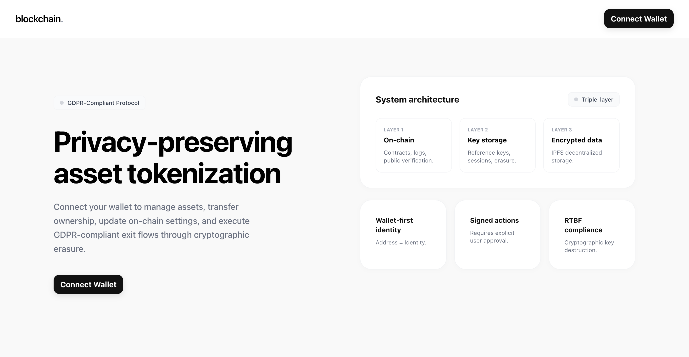

# PrivacyChain

A working proof-of-concept for a **Privacy-Preserving Right to Be Forgotten (RTBF)** framework on blockchain — cryptographic erasure across a triple-layer architecture (on-chain registry, off-chain key management, encrypted IPFS storage), built as part of a PhD research project.

Blockchains can't delete data — every write is permanent by design. This project shows how to offer a GDPR-style "right to erasure" anyway, not by deleting on-chain records, but through **cryptographic erasure**: personal data is encrypted off-chain, and once its decryption key is destroyed, the encrypted bytes become permanently unreadable — even though they still physically exist on IPFS.



## Architecture

Three layers, each with a distinct trust and visibility model, plus a Next.js frontend:

| Layer | Role | What it stores |
|-------|------|-----------------|
| **L1** — on-chain (Solidity / Hardhat) | Immutable public ledger | Pseudonymous identifiers, asset records, transaction IDs, RTBF exit proofs |
| **L2** — key management (Node / Express) | Secure-enclave simulation | Per-transaction reference keys (`Kr`), destroyed on RTBF exit; the sole gateway to L3 |
| **L3** — encrypted storage (Node / Helia IPFS) | Decentralised storage simulation | AES-256-GCM encrypted blobs (user PII, asset metadata) |
| **Frontend** — Next.js | The only human-facing layer | Talks to L1 via wallet transactions, and to L2's gateway (signed, wallet-authenticated) for everything encrypted |

**The demo, end to end:** register a user (PII encrypted to L3) → an admin approves the registration → create an asset (metadata encrypted to L3) → retrieve it (decrypts fine) → request an RTBF exit → L2 destroys the encryption key and anchors a proof hash on-chain → retrieve the same data again → it now returns `410 Gone`, even though the encrypted blob is still pinned on IPFS.

## Prerequisites

- **Node 22** (pinned in `.nvmrc` — the L3 service uses Helia/IPFS, which requires it)
- **MetaMask** (or any injected wallet) pointed at a local Hardhat chain
- `python3` (used to serve a one-click "add network to MetaMask" helper page)

## Quick start

```bash
nvm use
npm install
npm run dev
```

`npm run dev` runs `scripts/dev-up.sh`, which:

1. Starts a local Hardhat chain on `:8545`
2. Deploys the `AssetRegistry` contract, writing `shared/deployments/localhost.json` (the single source of truth for the contract address/ABI, read by both L2 and the Frontend)
3. Starts L2 (`:3001`) — it must be up before seeding so it captures every seed event
4. Starts L3 (`:3002`)
5. Seeds deterministic fixtures: three registered users (alice/bob/carol) plus seven assets with encrypted metadata, so every run starts from the same reproducible state
6. Starts a MetaMask network-setup helper on `:8080`
7. Starts the Frontend dev server

Once it's up, open the Frontend, connect a wallet pointed at the local Hardhat network (use the `:8080` helper to add it to MetaMask in one click), and walk through the demo sequence above. Hardhat's deterministic accounts #0–#3 are pre-seeded as admin/alice/bob/carol; any other account (#4+) starts unregistered.

Use `npm run dev:no-seed` to skip fixture seeding.

### Port map

| Port | Service |
|------|---------|
| 8545 | Hardhat RPC |
| 3001 | L2 key management |
| 3002 | L3 encrypted storage |
| 8080 | MetaMask setup helper |
| 3005 | Frontend (Next.js) |

## Workspace scripts

Run from the repo root:

| Script | What it does |
|--------|---------------|
| `npm run dev` | Full stack: chain + deploy + L2 + L3 + seed + Frontend |
| `npm run dev:no-seed` | Same, without seeding fixtures |
| `npm run contracts:test` | Hardhat/Chai unit tests for `AssetRegistry` |
| `npm run contracts:deploy:local` | Deploy the contract to a running local Hardhat node |
| `npm run contracts:deploy:sepolia` | Deploy to Sepolia (needs `SmartContracts/.env`) |
| `npm run contracts:seed:local` | Re-run just the fixture seeding |
| `npm run contracts:demo` | Scripted, Frontend-free walkthrough of the full 9-step RTBF sequence across L1/L2/L3 — the fastest way to see the mechanism without a browser or wallet |
| `npm run l2:dev` | Start only the L2 key-management service |
| `npm run l3:dev` | Start only the L3 encrypted-storage service |
| `npm run frontend:dev` | Start only the Frontend |
| `npm run frontend:build` | Production build of the Frontend |
| `npm run test:e2e` | Playwright end-to-end test driving the full RTBF flow through the real UI |
| `npm test` | `contracts:test` followed by `test:e2e` |

`SmartContracts/scripts/` also has `upgrade.ts`, for deploying a new implementation behind the existing UUPS proxy without losing on-chain state (the proxy address never changes).

## Testing

```bash
npm run contracts:test   # Hardhat/Chai unit tests
npm run test:e2e         # Playwright — drives register → approve → create asset →
                          # approve → verify encrypted metadata → request erasure →
                          # confirm the erasure proof anchors on-chain, through the
                          # real UI with a mock EIP-1193 wallet backed by a Hardhat
                          # test account (see Frontend/e2e/mock-wallet.ts)
```

`scripts/smoke-transfer-rekey.ts` and `scripts/smoke-exit-disposition-rekey.ts` are standalone smoke tests for the re-keying logic that runs when an asset is transferred, or dispositioned on exit, to a new owner — run them against a live `npm run dev` stack with `npx tsx scripts/<name>.ts`.

## Project structure

```
SmartContracts/    L1 — Hardhat/Solidity, UUPS-upgradeable AssetRegistry contract
L2/                L2 — Node/TypeScript key-management service (:3001)
L3/                L3 — Node/TypeScript encrypted-storage service (:3002, Helia IPFS)
Frontend/          Next.js dApp (:3005)
shared/            Deployment artifact + MetaMask setup helper, shared across workspaces
scripts/           Dev-stack orchestration and rekey smoke tests
```

## Supervision

This project was developed as part of a PhD research programme at the **University of Nicosia**, under the supervision of:

- Harald Gjermundrod — gjermundrod.h@unic.ac.cy
- Ioanna Dionysiou — dionysiou.i@unic.ac.cy
- Elias Iosif — iosif.e@unic.ac.cy

## Acknowledgments

Frontend built in collaboration with Ranya Rizki (ranya.rizki@etu.univ-tours.fr).

## License

[MIT](LICENSE)
